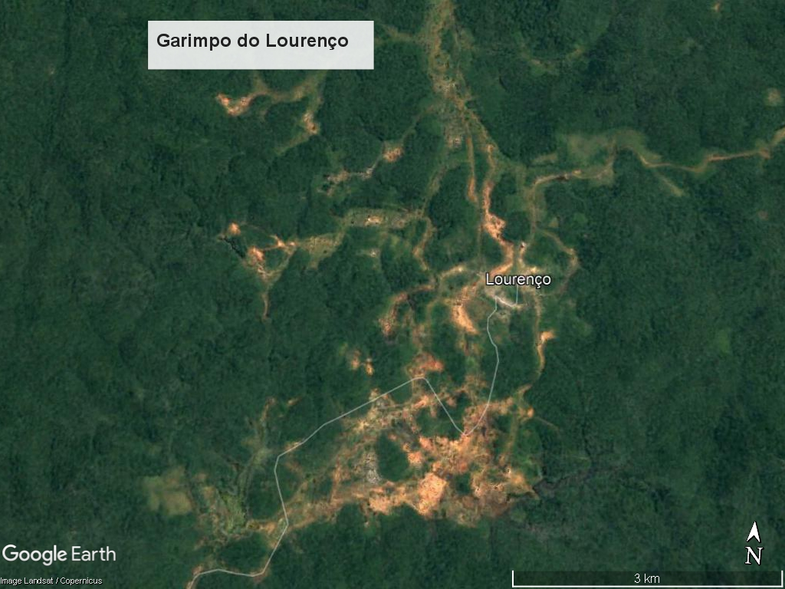

# Amapa-mine
Mineração e desmatamento no Amapá. Mining and deforestation in Amapá.

Código de [R](https://cran.r-project.org/) e dados para calcular 
métricas de paisagem associadas com a exploração de recursos minerários. 

Objetivo é calcular métricas de paisagem e descrever a composição e a configuração da paisagem no entorno do Garimpo do Lourenço.

As métricas de paisagem são a forma que os ecólogos de paisagem usam 
para descrever os padrões espaciais de paisagens para depois avaliar 
a influência destes padrões espaciais nos padrões e processos ecológicos. 
As análises aqui apresentados tem como base teórica o modelo 
"mancha-corredor-matriz" - uma representação da paisagem em manchas 
de habitat (fragmentos). 

## Conteúdo
Os dados aqui apresentados (gráficos, mapas) representam conteúdo do 
domínio público, disponibilizados pelos institutos, órgãos e entidades
federais, estaduais e privados ([IBGE](https://www.ibge.gov.br/),  [MapBiomas](https://mapbiomas.org/), [Agência Nacional de Mineração](https://dados.gov.br/dataset/sistema-de-informacoes-geograficas-da-mineracao-sigmine) ). O conteúdo está aqui apresentado para divulgação ampla, respetiando as obrigações de transparência, assim para agilizar e 
facilitar o desenvolvimento técnico científco. O conteúdo não 
representar versões ou produtos  finais e não devem ser apresentados/relatados/compartilhados/interpretados como conclusivos. 

Os mapas e cartogramas ficam na pasta [figures](https://github.com/darrennorris/Amapa-mine/tree/main/figures) (formato .png e .tif), dados geoespaciais "vector" na pasta [vector](https://github.com/darrennorris/Amapa-mine/tree/main/data/vector) (formato shapefile e GPKG) e "raster" na pasta [raster](https://github.com/darrennorris/Amapa-mine/tree/main/data/raster). 

Pacotes necessarios: 
library(sf)
library(tidyverse)
library(landscapemetrics)
library(terra)
library(readxl)
library(mapview)
library(units)

- [Área de estudo](#areadestudo)
  * [Ponto geografico](#Ponto)
  * [Educação e maternidade](#educacao)
- [Mineração](#mineracao)

## Área de estudo
Estabelecer a extensão da área de estudo com base nos objetivos e 
estudos anteriores.
Mineração pode aumentar a perda da floresta até 70 km além dos limites 
do processo de mineração:
Sonter et. al. 2017.
Mining drives extensive deforestation in the Brazilian Amazon
https://www.nature.com/articles/s41467-017-00557-w

Para visualizar um exemplo:
https://earthengine.google.com/timelapse/#v=-1.70085,-56.45017,8.939,latLng&t=2.70

### Ponto
Aqui vamos incluir um raio de 20 km além do ponto de acesso para 
o Garimpo do Lourenço em 1985.
Isso representa uma área quadrada de 40 x 40 km (1600 km2).

garimpo <- data.frame(nome = "garimpo do Lourenço", 
           coord_x = -51.630871, 
           coord_y = 2.318514)
#Converter para objeto espacial
sf_garimpo <- st_as_sf(garimpo, 
               coords = c("coord_x", "coord_y"),
            crs = 4326)
plot(sf_garimpo)
mapview(sf_garimpo) #verificar com mapa de base (OpenStreetMap)

Como as análises da paisagem associadas com o modelo 
"mancha-corredor-matriz" depende de uma classificação categórica deve 
optar para sistema de coordenados projetados com área igual e 
com unidade em metros.

 
Temos um raio de 20 km, que é um area geografica 
onde o retângulo envolvente é menor que um fuso [UTM](https://forest-gis.com/2016/06/um-pouco-sobre-a-projecao-utm.html/).
Assim sendo, vamos adotar a sistema de coordenados projetados de UTM 22N:
EPSG:31976 (SIRGAS 2000 / UTM zone 22N).
