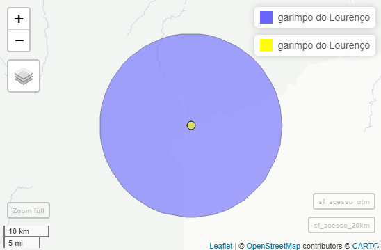

# Amapa-mine
Mineração e desmatamento no Amapá. Mining and deforestation in Amapá.


Código de [R](https://cran.r-project.org/) e dados para calcular 
métricas de paisagem associadas com a exploração de recursos minerários. 

O objetivo é calcular métricas de paisagem e descrever a composição e 
a configuração da paisagem no entorno do Garimpo do Lourenço.

As métricas de paisagem são a forma que os ecólogos de paisagem usam 
para descrever os padrões espaciais de paisagens para depois avaliar 
a influência destes padrões espaciais nos padrões e processos ecológicos. 
Este exemplo tem como base teórica o modelo 
"mancha-corredor-matriz" - uma representação da paisagem em manchas 
de habitat (fragmentos). 

## Conteúdo

- [Organização](#organizacao)
- [Área de estudo](#areadestudo)
  * [Ponto de referência (EPSG: 4326)](#ponto)
  * [Ponto de referência (EPSG: 31976)](#ponto31976)  
  * [Espaço](#espaco)
- [Calculo de métricas?](#primeiros)
  * [Métricas para a paisagem](#met-paisagem)
  * [Métricas para as classes](#met-classes)
  * [Métricas para as manchas](#met-manchas)
- [Quais métricas devo escolher?](#quais)


<a id="organizacao"></a>
## Organização
Os dados aqui apresentados (gráficos, mapas) representam conteúdo do 
domínio público, disponibilizados pelos institutos, órgãos e entidades
federais, estaduais e privados ([IBGE](https://www.ibge.gov.br/),  [MapBiomas](https://mapbiomas.org/), [Agência Nacional de Mineração](https://dados.gov.br/dataset/sistema-de-informacoes-geograficas-da-mineracao-sigmine) ). O conteúdo está apresentado para divulgação ampla, 
respetiando as obrigações de transparência, assim para agilizar e 
facilitar ensino e o desenvolvimento técnico científco. O conteúdo não 
representar versões ou produtos  finais e não devem ser apresentados/relatados/compartilhados/interpretados como conclusivos. 

Os gráficos e mapas ficam na pasta [figures](https://github.com/darrennorris/Amapa-mine/tree/main/figures) (formato .png e .tif), dados geoespaciais "vector" na pasta [vector](https://github.com/darrennorris/Amapa-mine/tree/main/data/vector) (formato shapefile e GPKG) e "raster" na pasta [raster](https://github.com/darrennorris/Amapa-mine/tree/main/data/raster). 


Pacotes necessarios:
```{r}
library(sf)
library(tidyverse)
library(landscapemetrics)
library(terra)
library(readxl)
library(mapview)
```

<a id="areadestudo"></a>
## Área de estudo
Estabelecer a extensão da área de estudo com base nos objetivos e 
estudos anteriores.
Mineração pode aumentar a perda da floresta até 70 km além dos limites 
do processo de mineração:
Sonter et. al. 2017.
Mining drives extensive deforestation in the Brazilian Amazon
https://www.nature.com/articles/s41467-017-00557-w

Para visualizar um exemplo:
https://earthengine.google.com/timelapse/#v=-1.70085,-56.45017,8.939,latLng&t=2.70

<a id="ponto"></a>
### Ponto de referência (EPSG: 4326)
Aqui vamos incluir um raio de 20 km além do ponto de acesso para 
o Garimpo do Lourenço em 1985.
Isso representa uma área quadrada de 40 x 40 km (1600 km2).

```{r}
acesso <- data.frame(nome = "garimpo do Lourenço", 
           coord_x = -51.630871, 
           coord_y = 2.318514)
#Converter para objeto espacial
sf_acesso <- st_as_sf(acesso, 
               coords = c("coord_x", "coord_y"),
            crs = 4326)
plot(sf_acesso) # teste basica
mapview(sf_acesso) #verificar com mapa de base (OpenStreetMap)
```


<a id="ponto31976"></a>
### Ponto de referência (EPSG: 31976)
As análises da paisagem com o modelo "mancha-corredor-matriz" depende 
de uma classificação categórica. Portanto, deve 
optar para uma sistema de coordenados projetados, com área igual e 
com unidade em metros. Temos um raio de 20 km, que é um area geografica 
onde o retângulo envolvente é menor que um fuso [UTM](https://forest-gis.com/2016/06/um-pouco-sobre-a-projecao-utm.html/).
Assim sendo, vamos adotar a sistema de coordenados projetados de 
datum SIRGAS 2000, especificamente EPSG:31976 (SIRGAS 2000/UTM zone 22N).

Precisamos então reprojetar o objeto original (em coordenados geograficas) 
para a sistema de coordenados projetados. Em seguida, vamos produzir 
um polígono com raio de 20 km no entorno do ponto.

```{r}
#reprojetar
sf_acesso_utm <- st_transform(sf_acesso, crs = 31976)

#polígono com raio de 20 km no entorno do ponto
sf_acesso_20km <- st_buffer(sf_acesso_utm, dist=20000)

#verificar com mapa de base (OpenStreetMap)
mapview(sf_acesso_20km) + 
  mapview(sf_acesso_utm, color = "black", col.regions = "yellow")
```


<a id="espaco"></a>
### Espaço

Agora vamos olhar o espaco que preciso. 
Arquivo de raster MapBiomas cobertura de terra ao redor do 
Garimpo do Lourenço em 1985: [utm_cover_AP_lorenco_1985.tif](https://github.com/darrennorris/Amapa-mine/blob/main/data/raster/Mapbiomas_cover_lourenco_utm/utm_cover_AP_lorenco_1985.tif)


Este vez a entrada de dados espaciais seria atraves a importação de 
um raster (arquivo de .tif). Lembre-se, para facilitar, os dados deve 
ficar no mesmo diretório do seu código 
(verifique com <code>getwd()</code>). 
Como nós já sabemos a sistema de coordenados desejadas, 
o geoprocessamento da raster foi concluído antes de começar com as 
análises da paisagem.


```{r}
r1985 <- rast("utm_cover_AP_lorenco_1985.tif")
r1985

#class       : SpatRaster 
#dimensions  : 1341, 1341, 1  (nrow, ncol, nlyr)
#resolution  : 29.87713, 29.87713  (x, y)
#extent      : 409829.5, 449894.7, 236241.1, 276306.3  (xmin, xmax, ymin, ymax)
#coord. ref. : SIRGAS 2000 / UTM zone 22N (EPSG:31976) 
#source      : utm_cover_AP_lorenco_1985.tif 
#name        : classification_1985 
#min value   :                   3 
#max value   :                  33 

```
Ou use o função <code>file.choose()</code>, que faz a busca 
para arquivos. 

```{r}
r1985 <- rast(file.choose())
r1985
```

Ou digitar o endereço do arquivo.

```{r}
raster_in <- "data/raster/Mapbiomas_cover_lourenco_utm/utm_cover_AP_lorenco_1985.tif"
r1985 <- rast(raster_in)
r1985
```

Agora que o arquivo foi importado, podemos visualizá- lo.

```{r, warning = FALSE}
#Visualizar
#Gradiente de cores padrao nao corresponde 
#ao mundo real (por exemplo verde não é floresta)
plot(r1985) 
plot(sf_acesso_20km, add = TRUE, lty ="dashed", color = "black")
plot(sf_acesso_utm, add = TRUE, cex = 2, pch = 19, color = "black")

```


<a id="primeiros"></a>
## Calculo de métricas

Vamos olhar alguns exemplos de métricas para cada nível da análise: 
* patch (para a mancha ou fragmento), 
* class (métricas por classe ou tipo de habiat) e 
* landscape (métricas para a paisagem como um todo).

Primeiro, pecisamos verificar se o raster está no formato correto.
```{r, warning = FALSE}
check_landscape(r1985)
#  layer crs    units   class n_classes OK
#  1  projected   m   integer         7  v
```
Tudo certo (veja a coluna do "OK")!


<a id="met-paisagem"></a>
### Métricas para a paisagem

Vamos começar avaliando a área total da paisagem (área) de estudo.

```{r, warning = FALSE}
area.total <- lsm_l_ta(r1985) 
area.total #160264 Hectares
```
Agora vamos ver a distância total de borda (te= “total
edge”).

```{r, warning = FALSE}
te <- lsm_l_te(r1985)
te # 547140 metros
```
Total de borda mede a configuração da paisagem porque uma paisagem 
altamente fragmentada terá muitas bordas. No entanto, a borda total 
é uma medida absoluta, dificultando comparações entre paisagens com  
áreas totais diferentes. Mas pode ser aplicado para comparar a 
configuração na mesma paisagem em anos diferentes. 

Agora vamos ver a densidade de Borda (“Edge Density”). 
Densidade de Borda mede a configuração da paisagem porque uma paisagem 
altamente fragmentada terá valores mais altas. "Densidade" é uma medida 
adequado para comparacoes de paisagens com áreas totais diferentes.

```{r, warning = FALSE}
ed <- lsm_l_ed(r1985) 
ed #3.41 metros por hectare
```

<a id="met-classes"></a>
### Métricas para as classes

Area de cada class em hectares.

```{r, warning = FALSE}
lsm_c_ca(r1985) 

```
Como tem varios classes é dificil de interpretar os resultados porque 
os numeros (3, 4, 11.....) não tem uma referncia do mundo real.
Para entender os resultados, podemos acrescentar nomes para os valores. 
Ou seja incluir uma coluna de legenda com os nomes. Para isso 
precisamos outro arquivo com os nomes.
Arquivo de legenda ([mapbiomas_6_legend.xlsx](https://github.com/darrennorris/Amapa-mine/blob/main/data/raster/Mapbiomas_cover_lourenco_utm/mapbiomas_6_legend.xlsx)).
```{r, warning = FALSE}
mapvals <- read_excel("data//raster//Mapbiomas_AP_equalarea//mapbiomas_6_legend.xlsx")

```

Agora rodar de novo, com os resultados juntos com a legenda 
de cada class. Nos resultadosOs acima, os valores na coluna "class" 
são as mesmas que tem na coluna "aid" no objeto "mapvals", onde também 
tem os nomes . Assim, podemos repetir, mas agora incluindo os nomes 
para cada valor de class, com base na ligação (join) entre as colunas. 

```{r, warning = FALSE}
#Area de cada class em hectares, incluindo os nomes para cada class
lsm_c_ca(r1985) %>% 
  left_join(mapvals, by = c("class" = "aid"))
  
#Numero de fragmentos (patches)
lsm_c_np(r1985) %>% 
  left_join(mapvals, by = c("class" = "aid"))
```

<a id="met-manchas"></a>
### Métricas para as manchas
Vamos calcular o tamanho de cada mancha agora.

```{r, warning = FALSE}
mancha_area <- lsm_p_area(r1985) # 630 manchas
mancha_area

```
Agora queremos saber o tamanho da maior mancha em cada class, e 
portanto o tamanho da maior mancha de mineração.

```{r, warning = FALSE}
mancha_area %>% 
group_by(class) %>% 
summarise(max_ha = max(value))
# 30.8 hectares (class 15 = mineração)

```

<a id="quais"></a>
## Quais métricas devo escolher?

A decisão deve ser tomada com base em uma combinação de fatores.
Incluindo tais fatores como: base teórica, considerações estatísticas, 
relevância para o objetivo/hipótese e a escala e heterogeneidade 
na paisagem de estudo.

Queremos caracterizar áreas de mineração na paisagem, e aqui vamos 
olhar somente uma paisagem, em um momento do tempo. Então as métricas 
para a paisagem como todo não tem relevância.

Estamos olhando uma classe (mineração), portanto vamos incluir as 
métricas para classes.


```{r, warning = FALSE}
# métricas de composição para a paisagem por classes
list_lsm(level = "class", type = "area and edge metric")

# métricas de configuração para a paisagem por classes
list_lsm(level = "class", type = "aggregation metric")

```

Aqui vamos calcular todos as metricas por classe (função <code>calculate_lsm()</code>)).

```{r, warning = FALSE}
# métricas de composição para a paisagem por classes
metrics_comp <- calculate_lsm(r1985, level = "class", type = "area and edge metric")

# métricas de configuração para a paisagem por classes
metrics_config <- calculate_lsm(r1985, level = "class", type = "aggregation metric")

```

E aqui, calcular correlações entre todos as metricas por classe 
(função <code>show_correlation()</code>)).

```{r, warning = FALSE}

show_correlation(data = metrics_comp, method = "pearson", labels = TRUE)

show_correlation(data = metrics_config, method = "pearson", labels = TRUE)

```
Temos muitos valores e muitas métricas. 
Este se chama um "tiro no escuro", algo cujo resultado se desconhece 
ou é imprevisível. Isso não é recomendado. 
Para fazer uma escolha melhor (mais robusta), seguindo princípios 
básicos da ciência, precisamos ler os estudos anteriores 
(artigos) para obter as métricas mais relevantes para nosso objetivo e 
a hipótese a ser testada. Com base em os estudos anteriores e os 
objetivos vamos incluir 11 métricas 
(5 de composição e 6 de configuração). 

Métricas de composição:
* mean patch area (<code>lsm_c_area_mn</code>)
* SD patch area (<code>lsm_c_area_sd</code>)
* total (class) area (<code>lsm_c_ca</code>)
* edge density (<code>lsm_c_ed</code>)
* largest patch index (<code>lsm_c_lpi</code>)

Métricas de configuração:
* aggregation index (<code>lsm_c_ai</code>)
* patch cohesion index (<code>lsm_c_cohesion</code>)
* mean euclidean nearest neighbor distance (<code>lsm_c_enn_mn</code>)
* SD euclidean nearest neighbor distance (<code>lsm_c_enn_sd</code>)
* number of patches (<code>lsm_c_np</code>)
* patch density (<code>lsm_c_pd</code>)

O próximo passo é comunicar os resultados obtidos. Para isso 
precisamos resumir e apresentar as métricas selecionadas em tabelas e 
figuras.
